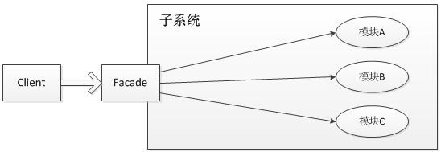

## 1. 设计模式六大原则
### 1.1.关闭原则(总原则):
- 对扩展开放,对修改关闭,实现一个热插播的效果

### 1.2.单一职责原则:
- 每个类应该实现单一的职责,如果不是应该拆分

### 1.3.里氏替换原则(面向对象设计的基本原则之一):
- 任何基类可以出现的地方,子类一定可以出现,子类尽量不要重写或者重载

### 1.4.依赖倒转原则:
- 依赖于抽象而不是具体,面向接口编程,不与具体类交互,而与上层接口交互

### 1.5.接口隔离原则:
- 每个接口中不存在子类用不到缺必须实现的方法,若不然则应拆分

### 1.6.迪米特原则:
- 一个类对自己依赖的类知道的的越少越好

### 1.7.合成服用原则:
- 尽量使用集成/聚合的方式,而不是使用继承

## 2. Java的23种设计模式
### 2.1.工厂模式
#### 2.1.1.工厂方法模式

#### 2.1.2.抽象工厂模式

### 2.2.单例模式
优点:对于某些大型的对象,省去重复创建时的系统开销,并降低GC的压力

#### 2.2.1.懒汉式:
>
    public static Singleton getInstance() {
        if (instance == null) { // 第一次创建需要锁
            synchronized (instance) {
                if (instance == null) {
                    instance = new Singleton();
                }
            }
        }    
        return instace;
    }
    
### 2.3.建造者模式

### 2.4.原型模式
- 将一个对象作为原型,对其进行赋值,克隆,产生一个和原对象类似的新对象.Java中通过clone()来实现.

> 深复制和浅赋值
>
    1. 深复制:将一个对象赋值后,无论基本数据类型还是引用数据类型,都是重新创建的.
    2. 浅赋值:将一个对象赋值后,基本数据的变量都会重新创建,但引用类型的变量还是指向原来对象所指向的.
       Object的clone()是浅赋值.

### 2.5.适配器模式
#### 2.5.1.类的适配器模式
>代码如下:
>
	public class Source {
		public void sayHello() {
			System.out.println("hello!");
		}
	}
>	
	public interface Targetable {
		void sayHello();
		void sayWorld();
	}
>	
	public class Adapter extends Source implements Targetable {
		@Override
		public void sayWorld() {
			System.out.println("world!");
		}
	}
	
>	Targetable接口具有了Source类的实现功能
	

#### 2.5.2.对象的适配器模式
>适配器类不再继承Source类,而是拥有Source类对象:
>
	public class Wrapper implements Targetable {
>
		private Source source;
>
		public Wrapper(Source source) {
			this.source = source;
		}
>
		public void sayHello() {
			this.source.sayHello();
		}
>
		public void sayWorld() {
			System.out.println("World!");
		}
	}

#### 2.5.3.接口的适配器模式
- 适用场景:一个接口的实现类必须要实现接口的所有方法,而可能不需要那么多方法
>
	public interface Sourceable {
		void saySleep();
		void sayWalk();
	}
>
	public abstract class Wrapper2 implements Sourceable{
		public void saySleep() {}
		public void sayWalk() {}
	}
>
	public class SourceSub1 extends Wrapper2 {
>
		@Override
		public void saySleep() {
		System.out.println("sleep!");
		}
>
		@Override
		public void sayWalk() {
		System.out.println("walk!");
		}
	}

总结:
1. 类的适配器模式:当有一个类转换成满足一个新接口的时候,可以新建一个类继承原有类并实现该新的接口即可.
2. 对象适配器模式:当希望一个对象转换成满足一个新接口的对象时,可以创建Wrapper类持有原类的一个实例,然后在Wrapper类中调用实例方法即可.
3. 接口适配器模式:当不希望一个实现类实现指定接口的所有方法时,可以创建一个抽象类去实现该接口,然后该实现类继承抽象类即可.

### 2.6.装饰者模式
- 装饰类与被装饰类实现同一个接口,装饰类持有被装饰类的实例,装饰类会在实现的接口方法中通过被装饰类的实例调用原方法,并在其前后进行方法的增强.

>
	public class Decorator implements Sourceable {
>
		private Source source;
>
		public Decorator(Source source) {
			this.source = source;
		}
>
		@Override
		public void method() {
			System.out.println("before decorator");
			source.method();
			System.out.println("after decorator");
		}
	}
	
>
	public class Source implements Sourceable {
		@Override
		public void method() {
			System.out.println("original method!");
		}
	}
>
	public interface Sourceable {
		void method();
	}

### 2.7.代理模式
- 对象目标方法进行增强,代理类拥有被代理类的实例,可以调用原生方法.

>
	public interface Sourceable {
		void sayProxy();
	}
>
	public class Source implements Sourceable {
		@Override
		public void sayProxy() {
			System.out.println("hello origin!");
		}
	}
>
	public class Proxy implements Sourceable {
>
		private Source source;
>
		public Proxy() {
			// 与装饰者模式,对象的适配器模式的区别
			this.source = new Source();
		}
>
		@Override
		public void sayProxy() {
			System.out.println("before proxy");
			source.sayProxy();
			System.out.println("after proxy");
		}
	}

### 2.8.门面模式
- 解决类与类之间的依赖关系,门面模式可以将他们的关系放在一个Facade类中.外部与一个子系统的通信必须通过一个统一的外观对象是进行  
- 结构图如下:
  

> 门面对象的几个核心:
>
    1. 知道所有子角色的功能和责任
    2. 将客户端发来的请求委派到子系统中,没有实际业务逻辑
    3. 不参与子系统内业务逻辑的实现

>
	public interface Action {
		void startup();
		void shutdown();
	}
>
	public class CPU implements Action {
>
		@Override
		public void startup() {
			System.out.println("CPU start up!");
		}
>
		@Override
		public void shutdown() {
			System.out.println("CPU shut down!");
		}
	}
>
	public class Disk implements Action {
		@Override
		public void startup() {
			System.out.println("Disk start up!");
		}
>
		@Override
		public void shutdown() {
			System.out.println("Disk shut down!");
		}
	}
>
	public class Memory implements Action {
		@Override
		public void startup() {
			System.out.println("Memory start up!");
		}
>
		@Override
		public void shutdown() {
			System.out.println("Memory shut down!");
		}
	}
>
	public class Computer {
>
		private CPU cpu;
		private Disk disk;
		private Memory memory;
>
		public Computer() {
			this.cpu = new CPU();
			this.disk = new Disk();
			this.memory = new Memory();
		}
>
		public void startup() {
			System.out.println("computer start up!");
			this.cpu.startup();
			this.disk.startup();
			this.memory.startup();
		}
>
		public void shutDown() {
			System.out.println("computer shut down!");
			this.cpu.shutdown();
			this.disk.shutdown();
			this.memory.shutdown();
		}
>
		public Object getBean(String beanName) {
			if ("cpu".equalsIgnoreCase(beanName)) {
			    return this.cpu;
			} else if ("disk".equalsIgnoreCase(beanName)) {
			    return this.disk;
			} else if ("memory".equalsIgnoreCase(beanName)) {
			    return this.memory;
			}
			throw new NullPointerException();
		}
	}

### 2.9.桥接模式
- 将抽象画与实现化解耦,使得二者可以独立变化

### 2.10.组合模式
- 将多个对象组合在一起进行操作,常用于表示树形结构,如二叉树

### 2.11.享元模式
- 主要解决对象的共享问题,减少内存的开销,通常与工厂模式一起使用

### 2.12.策略模式
- 定义了一系列的算法,并将每个算法封装起来,使他们可以相互替换,且算法的变化不会影响到使用算法的客户

### 2.13.模板方法模式

### 2.14.观察者模式
- 当一个对象发生变化时,其他依赖该对象的对象都会收到通知,并且随着变化

